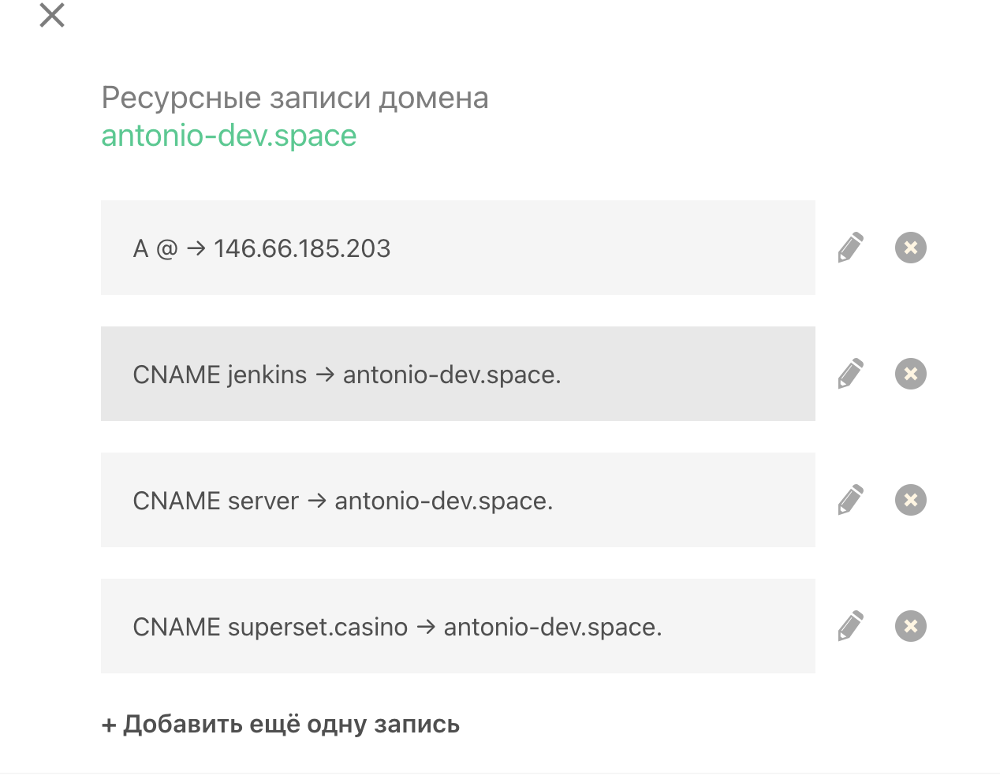
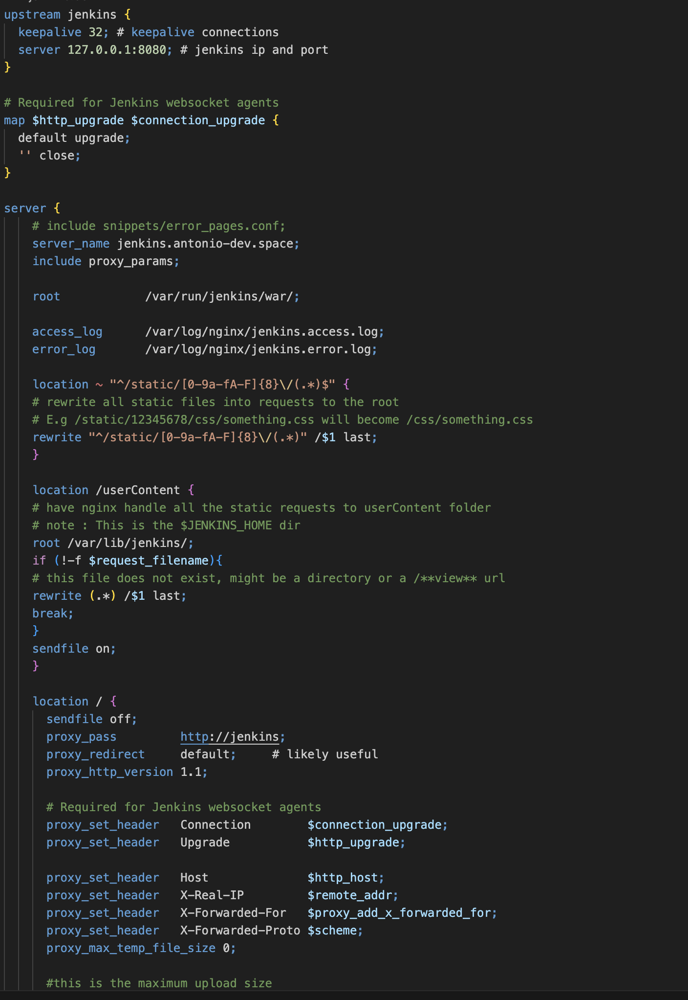
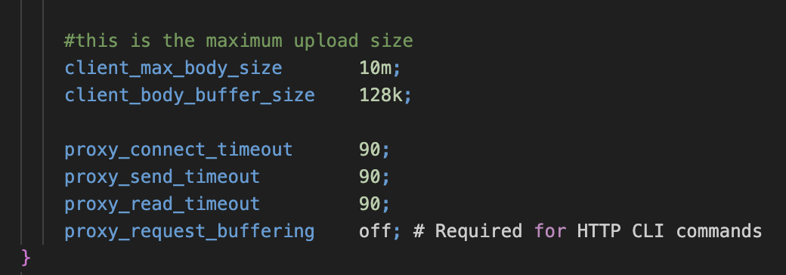
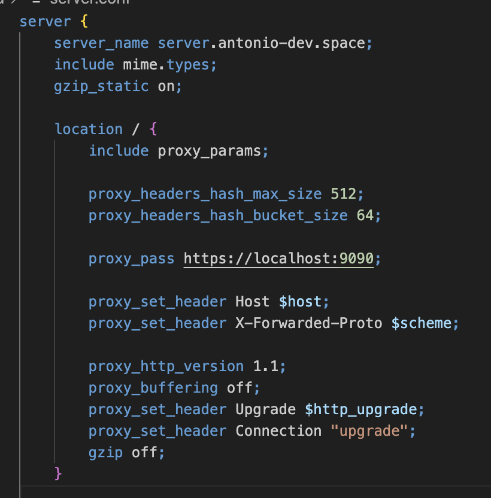
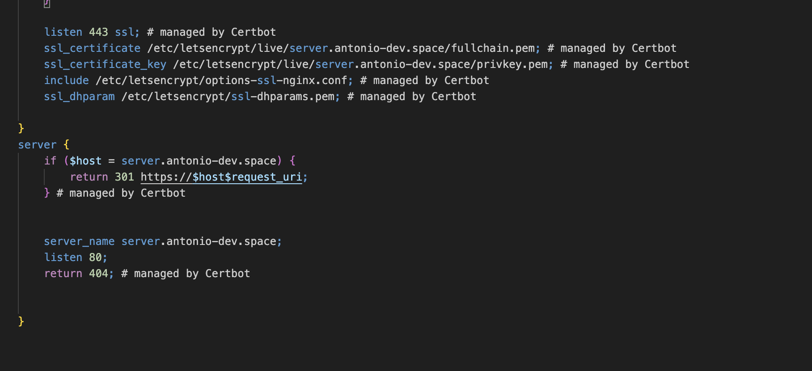

# Лабораторная работа 1

## Общее описание

В качестве сервера решил использовать свой домашний сервер c доменом antonio-dev.space. Два сервиса будут доступны по поддомену. 

Рассмотрим два сервиса: jenkins и cockpit (поддомен server).

1. Сперва на сайте с DNS нужно создать необходимые поддоменные записи на сайте, который предоставляет услуги по распространению домена по DNS серверам. Были созданы необходимые записи CNAME. 


2. Нужно было подождать какое-то время, пока dns записи распространялись по DNS серварам.

3. Для подключения https и экономии денег был подключен certbot, который использует и переодически меняет общедоступные ssl сертификаты. 

4. После того, как dns поддомены были распространены по dns серверам. Можно приступать к написанию nginx конфигов. 

5. Был написан базовый конфиг для jenkins




_Рассмотрим некоторые директивы_

- upstream - группа серверов. На моем сервере развернут один jenkins на порту 8080. Также используется для балансировки нагрзуки между несколькими серверами.

- server -  группа директиров, которые будут определять, что слушает сервер и каким образом.

- server name - какой домен слушаем. 

- location - как путь слушаем и как обрабатывем 

- остальные директивы очевидны по названию и рекомендованы разработчками jenkins. 

6. Аналогично конфиг для cockpit



_Рассмотрим некоторые нерасмотренные раннее директивы_

- gzip -  используется для сжатия передаваемых данных и оптимизации трафика.

7. Теперь можно приступать к настройке https. Для этого был установлен certbot для nginx.

8. Были введены следующие команды:

_Для cockpit_

```bash
sudo certbot --nginx -d jenkins.antonio-dev.space
```

_Для jenkins_

```bash
sudo certbot --nginx -d server.antonio-dev.space
```

9. После этого необходимы перезагрузить nginx

```bash
sudo systemctl restart nginx
```

10. Теперь jenkins и server доступны по https: https://server.antonio-dev.space и https://jenkins.antonio-dev.space соответственно.

11. Как видим, certbot отредактировал конфиги nginx: добавил необходимый порт и настроил редирект с http


