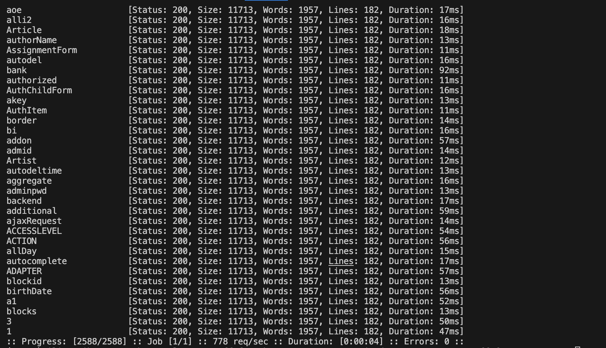

# Лабораторная работа 1 star

К сожалению, работа выполнялась достаточно поздно и не получилось найти сторонние nginx сервера( Поэтому был рассмотрен собственный сайт по собственному домену antonio-dev.space, а именно server.antonio-dev.space и jenkins.antonio-dev.space. Однако считаю работу тоже достаточно интересной, чтобы проверить на уязвимости конфиги, используемые разработчиками cockpit (server.antonio-dev.space) и jenkins. 

## FFUF

1. Первая инструмент, с помощью которого будут проверяться уязвимости, на которые будет проверяться сайт - FFUF. 

2. Были скачаны различные данные, которые потом будут подставляться, отсюда http://ffuf.me/wordlists.

3. Просканируем пути
* без поддомена
Ничего не нашлость

```bash
ffuf -u https://antonio-dev.space/FUZZ -w ffuf/common.txt
```


* jenkins 
Реагирует достаточно корректно. Выдает 403, если пытается зайти без токенов

```bash
ffuf -u https://jenkins.antonio-dev.space/FUZZ -w ffuf/common.txt
```


* cockpit
cockpit все нравится. Попробуем перейти и посмотреть что. По неизвестных путям просто оставляет на страничке входа
```bash
ffuf -u https://server.antonio-dev.space/FUZZ -w ffuf/common.txt
```


*сертификаты немного устарели походу*

4. Просканируем домены. Думаю смысла делать поддомены от поддоменов jenkins и server нет смысла.

jenkins видимо в базе нет, однако нашелся сервер. Чего-то критического не получилось найти. 


5. И попробуем различные query параметры

* у cockpit все аналогично как с обычными путями

```bash
ffuf -u https://server.antonio-dev.space?FUZZ=1 -w ffuf/parameters.txt
```



* у jenkins также 


* и у просто домена ничего не найдено


В итоге можно сделать вывод,  что тест через ffuf пройден успешно. Уязвимостей не обнаружено. 

## NMAP

Было просканировано через NMAP. Были просканированы узвимости XESS и инструментами уязвимостей из http-vuln. Уяязвимостей не обнаружено. Однако во время выполнения скрипта на server.antonio-dev.space была совершена ошибка. 


## CURL

 C помощью этой команды проверим заголовки http.


Были проверены редиректы. Обнаружена проблема. В конфиге указан редирект на https, однако он сработал только на server.antonio-dev.space. При этот в браузере редирект есть. Есть вероятность, что другой конфиг перекрыл. Есть один сервер, который работает только на http (временно).

Также было бы неплохо добавить следующие заголовки:

* X-Content-Type-Options: nosniff - помогает защитить от атак на основе контента, где злоумышленники могут попытаться загрузить вредоносные скрипты
* X-Frame-Options: - помогает против атак clickjacking
* Content-Security-Policy: - помогает от XESS-атак и внедрения данных
