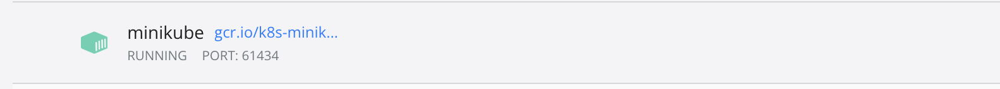
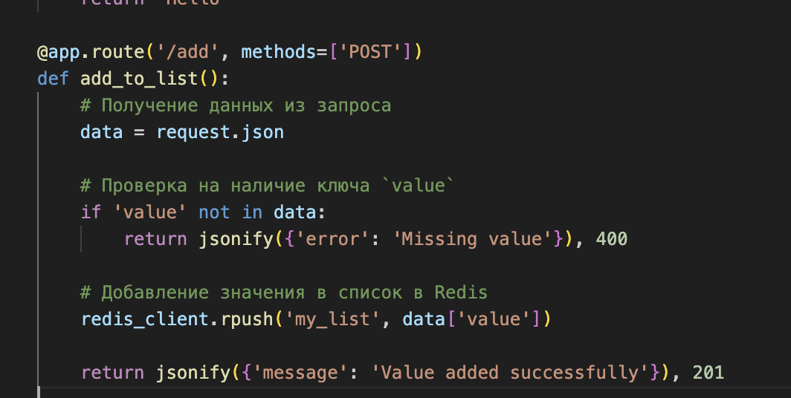
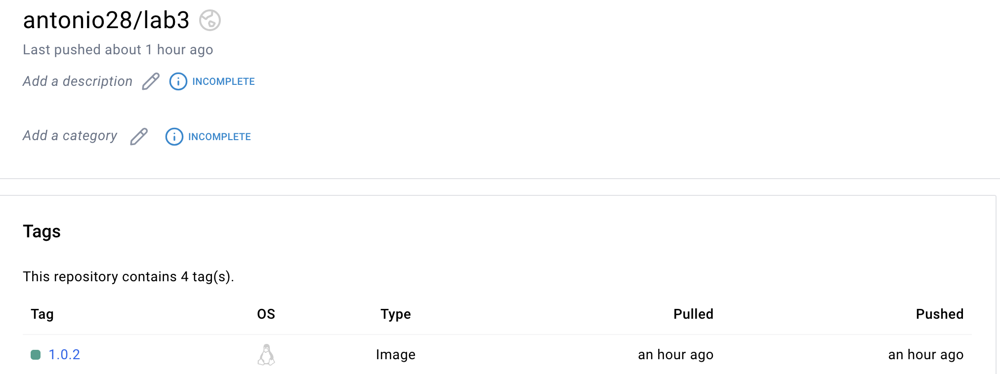
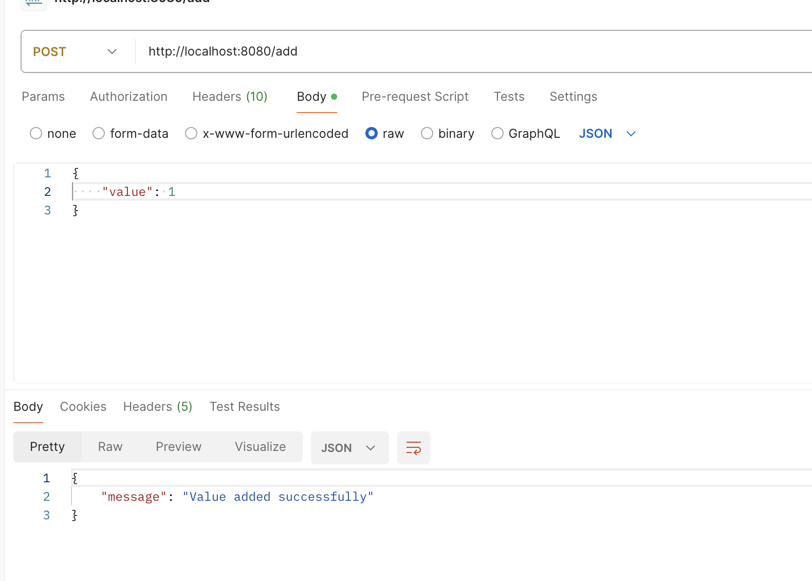
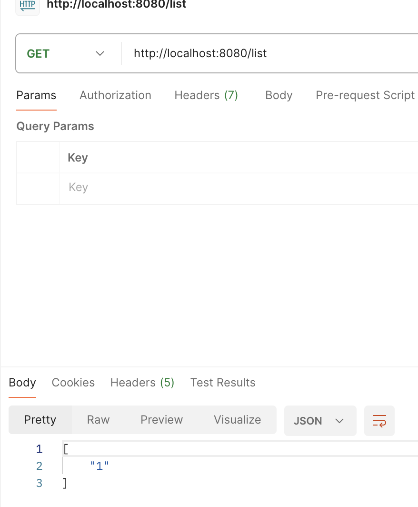

# Lab 3 Base

1. Был поднят minikube 

2. Было написано небольшое прпиложение, которое использует редис. Сохраняет туда в список значения.

3. Был создан образ приложение и запушен на dockerhub 

4. Были написаны манифесты для приложения
```yaml
apiVersion: apps/v1
kind: Deployment
metadata:
  name: flask-app
spec:
  replicas: 1
  selector:
    matchLabels:
      app: flask-app
  template:
    metadata:
      labels:
        app: flask-app
    spec:
      containers:
      - name: flask-app
        image: antonio28/lab3:1.0.2
        ports:
        - containerPort: 5000
        env:
        - name: REDIS_HOST
          value: "redis"
---
apiVersion: v1
kind: Service
metadata:
  name: flask-app
spec:
  selector:
    app: flask-app
  ports:
    - protocol: TCP
      port: 80
      targetPort: 5000
  type: NodePort
```
5. Используется сервис nodeport
6. Написаны манифесты для redis
```yaml
apiVersion: apps/v1
kind: Deployment
metadata:
  name: redis
spec:
  replicas: 1
  selector:
    matchLabels:
      app: redis
  template:
    metadata:
      labels:
        app: redis
    spec:
      containers:
      - name: redis
        image: redis:alpine
        ports:
        - containerPort: 6379
---
apiVersion: v1
kind: Service
metadata:
  name: redis
spec:
  selector:
    app: redis
  ports:
    - protocol: TCP
      port: 6379
      targetPort: 6379
```
5. Образы были запущены следующей командой
```bash
kubectl apply -f <file>
```
6. Для подключения к nodeport был сделан port forwarding
```bash
kubectl port-forward service/flask-app 8080:80
```
7. В итоге результаты

