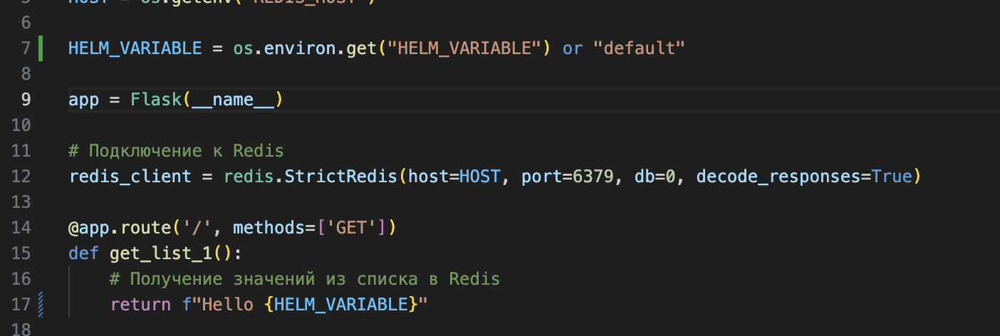
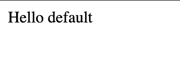
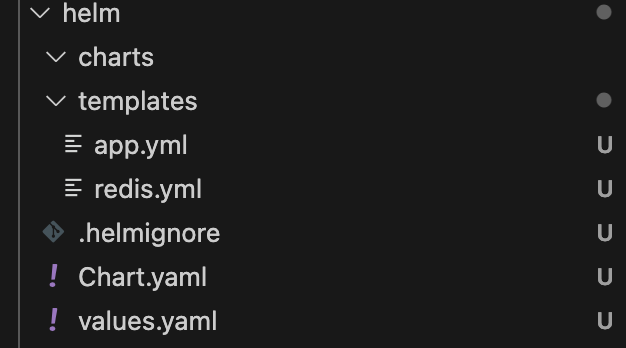
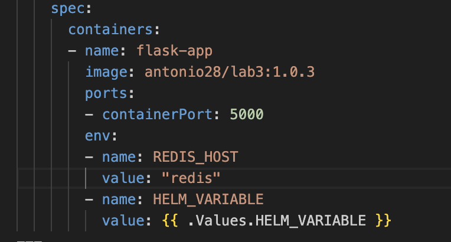
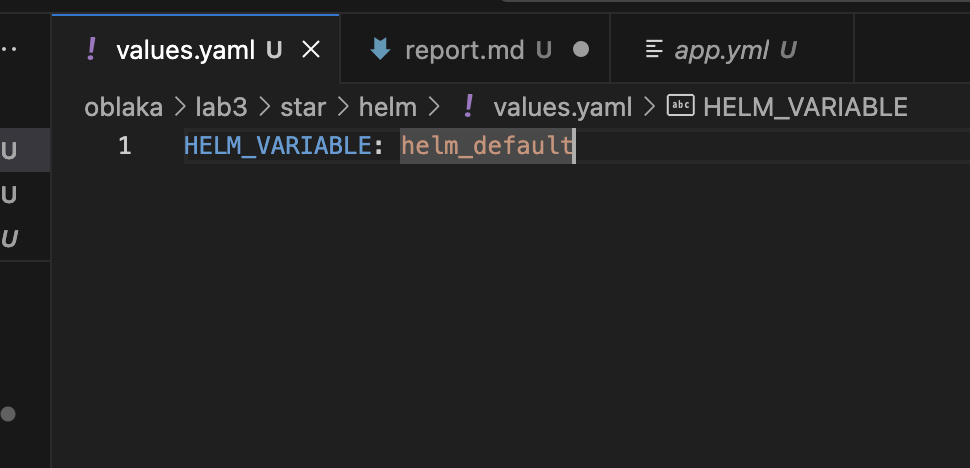
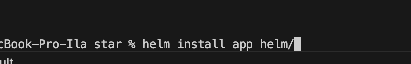
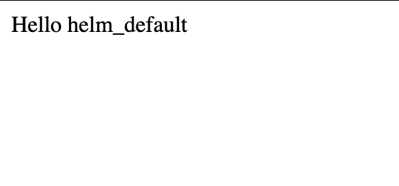
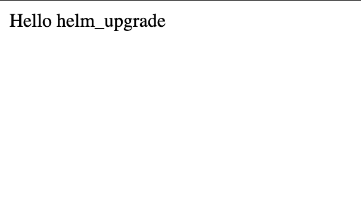

# Lab 3 Star

1. Прокачаем предыдущее приложение выводом переменной в браузере. Если переменная не указана, то выводится default. 





2. Был создан helm chart для приложения из предыдущей лабораторной 



3. Укажим переменную в шаблоне



4. Зададим значение переменной 



5. Запустим приложение через команы helm. Перед этим нужно сначала установить helm. 



6. В итоге получаем вывод нашей переменной, которую мы задали.



7. Теперь изменим эту же переменную, создадим еще один файлик с values, где заменим переменную на helm_upgradeю 

8. Введем команду

```bash
helm upgrade app helm/ --values helm/value_upgrade.yaml
```

9. Получим результат



10. Причины использовать helm, чем использовать классический k8s.

1) Чтобы изменить что-то в деплойменте или другом манифесте не нужно создавать новые файлы
2) Есть аналоги dockerhub, только для helm чартов, например https://artifacthub.io/. То есть можно пользоваться чужими чартами
3) Использование возможностей jinja, то есть возможность использования if, for и возможно макросов
