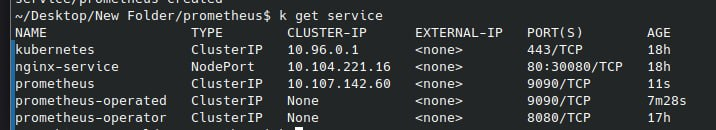
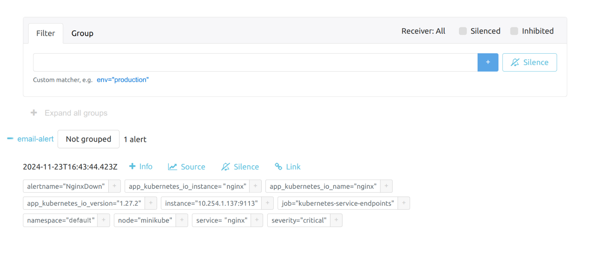

## Лабораторная работа №5

## Цель работы

Следить за работой сервиса, запущенного в Kubernetes, и показывать как минимум два графика работы, которые будут отражать состояние системы.

## 1 Подготовка кластера
В кластер устанавливаем prometheus operator и crd с помощью команды
```
kubectl create -f https://raw.githubusercontent.com/prometheus-operator/prometheus-operator/master/bundle.yaml
```
Для предоставления доступов создаём нужные rbac ресурсы:
```
apiVersion: v1
kind: ServiceAccount
metadata:
  name: prometheus
---
apiVersion: rbac.authorization.k8s.io/v1
kind: ClusterRole
metadata:
  name: prometheus
rules:
- apiGroups: [""]
  resources:
  - nodes
  - nodes/metrics
  - services
  - endpoints
  - pods
  verbs: ["get", "list", "watch"]
- apiGroups: [""]
  resources:
  - configmaps
  verbs: ["get"]
- apiGroups:
  - networking.k8s.io
  resources:
  - ingresses
  verbs: ["get", "list", "watch"]
- nonResourceURLs: ["/metrics"]
  verbs: ["get"]
---
apiVersion: rbac.authorization.k8s.io/v1
kind: ClusterRoleBinding
metadata:
  name: prometheus
roleRef:
  apiGroup: rbac.authorization.k8s.io
  kind: ClusterRole
  name: prometheus
subjects:
- kind: ServiceAccount
  name: prometheus
  namespace: default
```
## 2 Nginx

В качестве сервиса, который мы поднимем в кубе был выбран веб сервер nginx.
Для того, чтобы экспортировать его метрики в прометеус, рядом с nginx'ом был поднят nginx exporter в качестве sidecar'а (второй контейнер в том же поде).

Деплойменты nginx, nginx-exporter и их сервисы:
 ```
 apiVersion: apps/v1
kind: Deployment
metadata:
  name: nginx-deployment
  labels:
    app: nginx
spec:
  replicas: 1
  selector:
    matchLabels:
      app: nginx
  template:
    metadata:
      labels:
        app: nginx
    spec:
      containers:
      - name: nginx
        image: nginx:1.24.0
        volumeMounts:
        - name: nginx-config-volume
          mountPath: /etc/nginx/nginx.conf
          subPath: nginx.conf
        ports:
        - name: http
          containerPort: 80
      - name: nginx-exporter
        image: nginx/nginx-prometheus-exporter:1.3.0
        args:
          - --nginx.scrape-uri=http://127.0.0.1:8080/metrics
        ports:
         - name: metrics
           containerPort: 9113
      volumes:
      - name: nginx-config-volume
        configMap:
          name: nginx-config
---
apiVersion: v1
kind: Service
metadata:
  name: nginx-service
  labels:
    app: nginx
spec:
  type: ClusterIP
  selector:
    app: nginx
  ports:
    - name: metrics
      port: 9113
      targetPort: 9113
    - name: http
      port: 80
      targetPort: 80
      protocol: TCP
```
Чтобы заэкспоузить метрики nginx'а ему нужно включить stub_status на каком-нибудь эндпоинте (у нас это будет /metrics).
Для этого создаём nginx.conf:
```
events {
    worker_connections 128;
}

http {
   server {
     listen 8080;
     location /metrics {
         stub_status;
        }
    }
}
```
Конфиг прокидываем конфиг в качестве вольюма.


В аргументы запуска nginx-exporter прокидываем флаг "--nginx.scrape-uri=http://127.0.0.1:8080/metrics", который показывает откуда парсить метрики nginx'а.




## 3 Ресурсы Прометеуса

Создаём ресурсы прометеус:
```
apiVersion: monitoring.coreos.com/v1
kind: Prometheus
metadata:
  name: prometheus
  labels:
    app: prometheus
spec:
  image: quay.io/prometheus/prometheus:v2.22.1
  nodeSelector:
    kubernetes.io/os: linux
  replicas: 1
  resources:
    requests:
      memory: 400Mi
  securityContext:
    fsGroup: 2000
    runAsNonRoot: true
    runAsUser: 1000
  serviceAccountName: prometheus
  version: v2.22.1
  serviceMonitorSelector: {}
---
apiVersion: v1
kind: Service
metadata:
  name: prometheus
spec:
  type: NodePort
  ports:
  - name: web
    nodePort: 30090
    port: 9090
    protocol: TCP
    targetPort: web
  selector:
    prometheus: prometheus
```
Для мониторинга нашего сервиса nginx (nginx-exporter) создаем servicemonitor:
```
apiVersion: monitoring.coreos.com/v1
kind: ServiceMonitor
metadata:
  name: nginx-metrics
  labels:
    release: prometheus
spec:
  endpoints:
  - interval: 30s
    path: /metrics
    port: metrics
  selector:
    matchLabels:
      app: nginx

```
После создания servicemonitor во вкладке targets прометеуса появляется новый таргет:


## 4 Напоследок создаем графану:
```
---
apiVersion: v1
kind: PersistentVolumeClaim
metadata:
  name: grafana-pvc
spec:
  accessModes:
    - ReadWriteOnce
  resources:
    requests:
      storage: 1Gi
---
apiVersion: apps/v1
kind: Deployment
metadata:
  labels:
    app: grafana
  name: grafana
spec:
  selector:
    matchLabels:
      app: grafana
  template:
    metadata:
      labels:
        app: grafana
    spec:
      securityContext:
        fsGroup: 472
        supplementalGroups:
          - 0
      containers:
        - name: grafana
          image: grafana/grafana:latest
          imagePullPolicy: IfNotPresent
          ports:
            - containerPort: 3000
              name: http-grafana
              protocol: TCP
          readinessProbe:
            failureThreshold: 3
            httpGet:
              path: /robots.txt
              port: 3000
              scheme: HTTP
            initialDelaySeconds: 10
            periodSeconds: 30
            successThreshold: 1
            timeoutSeconds: 2
          livenessProbe:
            failureThreshold: 3
            initialDelaySeconds: 30
            periodSeconds: 10
            successThreshold: 1
            tcpSocket:
              port: 3000
            timeoutSeconds: 1
          resources:
            requests:
              cpu: 250m
              memory: 750Mi
          volumeMounts:
            - mountPath: /var/lib/grafana
              name: grafana-pv
      volumes:
        - name: grafana-pv
          persistentVolumeClaim:
            claimName: grafana-pvc
---
apiVersion: v1
kind: Service
metadata:
  name: grafana
spec:
  ports:
    - port: 3000
      protocol: TCP
      targetPort: http-grafana
  selector:
    app: grafana
  sessionAffinity: None
  type: LoadBalancer
```
В конфигурации grafana создаем новый datasource prometheus и указываем адрес нашего сервиса по порту созданного для прометеуса сервиса nodeport (30090)
Создаем несколько базовых дашбордов для мониторинга состояния сервиса:


## 5(*) Настройка алертинга
Алерт будем настраивать при помощи alertmanager'а.

alerts.yaml:
```
global:
  smtp_smarthost: 'smtp.mail.ru:465'
  smtp_from: 'polina.zvoda@gmail.com' СЮДА МАИЛ ОТКУДА БУДЕТ ОТПРАВЛЕН АЛЕРТ
  smtp_auth_username: 'polina.zvoda@gmail.com' СЮДА МАИЛ ОТКУДА БУДЕТ ОТПРАВЛЕН АЛЕРТ (должен совпадать со скрином с почты)
  smtp_auth_password: '***'

route:
  receiver: 'email-alert'

receivers:
  - name: 'email-alert'
    email_configs:
      - to: 'example@mail.ru' СЮДА МАИЛ ПОЛУЧАТЕЛЯ
        send_resolved: true

serverFiles:
  alerting_rules.yml:
    groups:
      - name: nginx_alerts
        rules:
          - alert: NginxDown
            expr: nginx_up == 0
            for: 0m
            labels:
              severity: critical
            annotations:
              summary: "Nginx is down on {{ $labels.instance }}"
```

Здесь мы настроили алертинг на почту, сам алерт будет срабатывать, когда метрика *nginx_up* приравняется к нулю (т.е скорее всего nginx упал).

Применяем конфигурацию (kubectl apply alerts.yaml).

Чтобы симулировать падение nginx'а, выполним команду: kubectl exec -it nginx-7b6cfc9d5c-2j4jv -c nginx -- pkill nginx

Заходим в UI AlertManager'а и видим, что нам прилетел ожидаемый алёрт:


